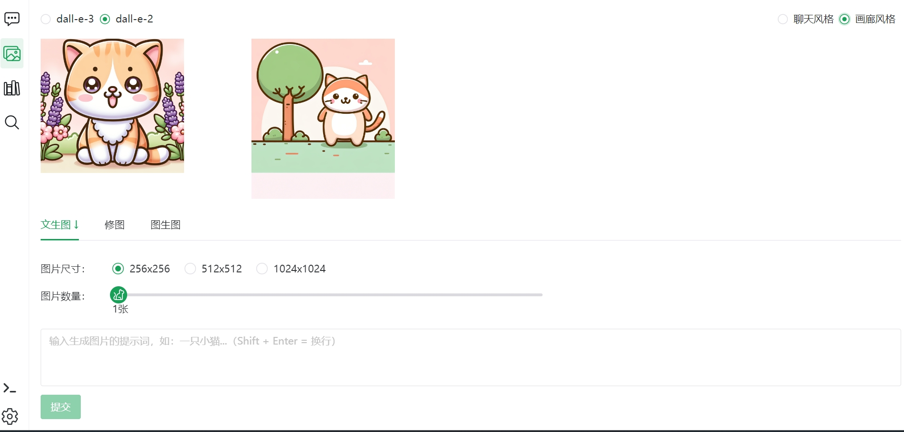
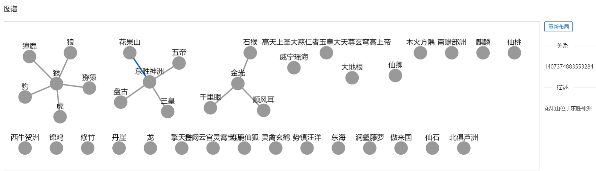
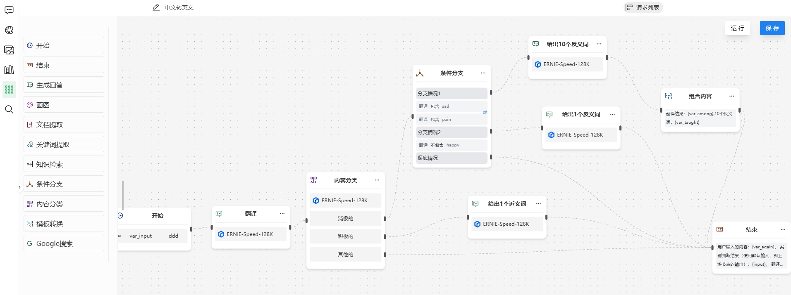

## Getting Started

**LangChain4j-AIDeepin（得应AI） 是基于AI的工作效率提升工具。**

 *可用于辅助企业/团队进行技术研发、产品设计、人事/财务/IT信息咨询、系统/商品咨询、客服话术支撑等工作*

> **🌟该项目如对您有帮助，欢迎点赞🌟**

## 系统组成及文档

[中文文档](README.md) | [English](README_en.md)

AIDEEPIN

&nbsp;&nbsp;&nbsp;&nbsp;&nbsp;&nbsp;|__ 服务端(langchain4j-aideepin)

&nbsp;&nbsp;&nbsp;&nbsp;&nbsp;&nbsp;|__ 用户端WEB(langchain4j-aideepin-web)

&nbsp;&nbsp;&nbsp;&nbsp;&nbsp;&nbsp;|__ 管理端WEB(langchain4j-aideepin-admin)

👉[详细文档](https://github.com/moyangzhan/langchain4j-aideepin/wiki)

后端服务代码地址：[github](https://github.com/moyangzhan/langchain4j-aideepin) 或 [gitee](https://gitee.com/moyangzhan/langchain4j-aideepin)

前端项目：

* 用户端WEB：langchain4j-aideepin-web
  * [github](https://github.com/moyangzhan/langchain4j-aideepin-web)
  * [gitee](https://gitee.com/moyangzhan/langchain4j-aideepin-web)
* 管理端WEB：langchain4j-aideepin-admin
  * [github](https://github.com/moyangzhan/langchain4j-aideepin-admin)
  * [gitee](https://gitee.com/moyangzhan/langchain4j-aideepin-admin)

## 体验网址

[http://www.aideepin.com](http://www.aideepin.com/)

## 功能点

* 多会话（多角色）
* 图片生成（文生图、修图、图生图）
* 基于大模型的知识库（RAG）
  * 向量搜索
  * 图搜索
* 基于大模型的网络搜索（RAG）
* AI工作流
* MCP服务市场
* ASR & TTS
  * 提问及回复的格式可选
    * 文字提问-文字回复
    * 文字提问-语音回复
    * 语音提问-文字回复
    * 语音提问-语音回复
  * AI的音色可选

## 接入的平台/模型：

* DeepSeek
* OpenAI
  * ChatGPT 3.5
  * DALL-E 2
  * DALL-E 3
* 灵积
  * 通义千问
  * 通义万相
* 硅基流动
* 文心一言
* ollama

## 接入的搜索引擎

Google

Bing (TODO)

百度 (TODO)

## 技术栈

该仓库为后端服务

技术栈：

* jdk17
* springboot 3.0.5
* [langchain4j(Java version of LangChain)](https://github.com/langchain4j/langchain4j)
* [langgraph4j](https://github.com/bsorrentino/langgraph4j)
* Postgresql
  * pgvector扩展：https://github.com/pgvector/pgvector
  * Apache AGE扩展：https://github.com/apache/age
* [neo4j 5.26.4+](https://neo4j.com/deployment-center/)

ps: neo4j 与 pgvector + apache age 二选一即可

前端技术栈：

* vue3
* vite
* typescript
* pnpm
* pinia
* naiveui

## 如何部署

### 初始化

**a. 初始化数据库**

+ 创建数据库aideepin
+ 执行docs/create.sql
+ 配置模型(至少设置一个) 或者 使用[管理端](https://github.com/moyangzhan/langchain4j-aideepin-admin)在界面上配置
      
    使用SQL直接更新表数据
    +  配置AI平台
        ```plain
        -- DeepSeek
        update adi_model_platform set api_key = 'my_deepseek_secret_key' where name = 'deepseek';

        -- openai的secretKey
        update adi_model_platform set api_key = 'my_openai_secret_key' where name = 'openai';

        -- 灵积大模型平台的apiKey
        update adi_model_platform set api_key = 'my_dashcope_api_key' where name = 'dashscope';

        -- 硅基流动的配置
        update adi_model_platform set api_key = 'my_siliconflow_api_key' where name = 'siliconflow_setting';

        -- 千帆大模型平台的配置
        update adi_model_platform set api_key = 'my_qianfan_api_key',secret_key='my_qianfan_secret_key' where name = 'qianfan';

        -- ollama的配置
        update adi_model_platform set base_url = 'my_ollama_base_url' where name = 'ollama';
        ```

  + 启用AI平台下的模型或新增模型

      ```plain
      -- Enable model
      update adi_ai_model set is_enable = true where name = 'deepseek-chat';
      update adi_ai_model set is_enable = true where name = 'gpt-3.5-turbo';
      update adi_ai_model set is_enable = true where name = 'dall-e-2';
      update adi_ai_model set is_enable = true where name = 'qwen-turbo';
      update adi_ai_model set is_enable = true where name = 'THUDM/GLM-Z1-9B-0414';
      update adi_ai_model set is_enable = true where name = 'ernie_speed';
      update adi_ai_model set is_enable = true where name = 'tinydolphin';

      -- Add new model
      INSERT INTO adi_ai_model (name, type, platform, is_enable) VALUES ('vicuna', 'text', 'ollama', true);
      ```

+ 填充搜索引擎的配置
    - Google的配置

      ```plain
      update adi_sys_config set value = '{"url":"https://www.googleapis.com/customsearch/v1","key":"my key from cloud.google.com","cx":"my cx from programmablesearchengine.google.com"}' where name = 'google_setting';
      ```

**b. 修改配置文件**

+ postgresql: application-[dev|prod].xml中的spring.datasource
+ redis: application-[dev|prod].xml中的spring.data.redis
+ 邮箱: application.xml中的spring.mail
+ 向量数据库，默认为 pgvector
  * application-[dev|prod].xml 中的 adi.vector-database=[pgvector|neo4j]
+ 图数据库，默认为 Apache age
  * application-[dev|prod].xml 中的 adi.graph-database=[apache-age|neo4j]

### 编译及运行

* 进入项目

  ```plaintext
  cd langchain4j-aideepin
  ```
* 打包：

  ```
  mvn clean package -Dmaven.test.skip=true
  ```
* 运行

  * jar包启动：

  ```plaintext
  cd adi-bootstrap/target
  nohup java -jar -Xms768m -Xmx1024m -XX:+HeapDumpOnOutOfMemoryError adi-bootstrap-0.0.1-SNAPSHOT.jar --spring.profiles.active=[dev|prod] dev/null 2>&1 &
  ```

  * docker启动

  ```plaintext
  cd adi-bootstrap
  docker build . -t aideepin:0.0.1
  docker run -d \
    --name=aideepin \
    -e APP_PROFILE=[dev|prod] \
    -v="/data/aideepin/logs:/data/logs" \
    aideepin:0.0.1
  ```

## 截图

**AI聊天：**


**AI画图：**



**知识库：**


**向量化：**


**知识图谱：**



**工作流：**



## 技术交流

* 先点赞🌟再加群，谢谢
* 有问题尽量在issue提，容易描述及跟踪处理
* 业余时间维护本项目，时间有限，所以群里提问不保证即时回复，请见谅

