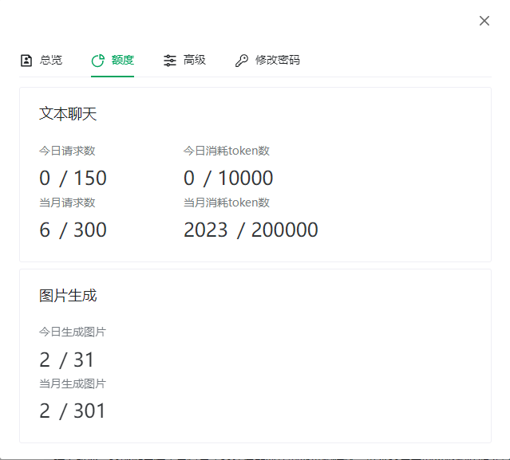

## Getting Started

**LangChain4j-AIDeepin**
基于 ChatGPT 等大语言模型与 Langchain4j 等应用框架实现，开源、可离线部署的检索增强生成(RAG)大模型知识库项目。

> **该项目如对您有帮助，欢迎点赞**

## 体验网址

[http://www.aideepin.com](http://www.aideepin.com/)

## 功能点

* 注册&登录
* 多会话（多角色）
* 图片生成（文生图、修图、图生图）
* 提示词
* 额度控制
* 基于大模型的知识库（RAG）
* 多模型随意切换

## 接入的模型：

* ChatGPT 3.5
* 通义千问
* 文心一言
* DALL-E 2

## 技术栈

该仓库为后端服务，前端项目见[langchain4j-aideepin-web](https://github.com/moyangzhan/langchain4j-aideepin-web)

后端：

jdk17

springboot3.0.5

[langchain4j(Java version of LangChain)](https://github.com/langchain4j/langchain4j)

**Postgresql(需要安装[pgvector](https://github.com/pgvector/pgvector)扩展)**

前端：

vue3+typescript+pnpm

## 如何部署

### 初始化

初始化数据库

* 创建数据库aideepin
* 执行docs/create.sql
* 填充openai的secretKey 或者 灵积模型的apiKey

```plaintext
update adi_sys_config set value = '{"secret_key":"my_openai_secret_key"}' where name = 'openai_setting';
update adi_sys_config set value = '{"api_key":"my_dashcope_api_key"}' where name = 'dashscope_setting';
```

* 修改配置文件

  * postgresql: application-[dev|prod].xml中的spring.datasource
  * redis: application-[dev|prod].xml中的spring.data.redis
  * mail: application.xml中的spring.mail

### 编译及运行

* 进入项目

```plaintext
cd langchain4j-aideepin
```

* 打包：

```
mvn clean package -Dmaven.test.skip=true
```

* 运行

a. jar包启动：

```plaintext
cd adi-bootstrap/target
nohup java -jar -Xms768m -Xmx1024m -XX:+HeapDumpOnOutOfMemoryError adi-chat-0.0.1-SNAPSHOT.jar --spring.profiles.active=[dev|prod] dev/null 2>&1 &
```

b. docker启动

```plaintext
cd adi-bootstrap
docker build . -t aideepin:0.0.1
docker run -d \
  --name=aideepin \
  -e APP_PROFILE=[dev|prod] \
  -v="/data/aideepin/logs:/data/logs" \
  aideepin:0.0.1
```

## 待办：

增强RAG


## 截图

**AI聊天：**




**知识库：**


