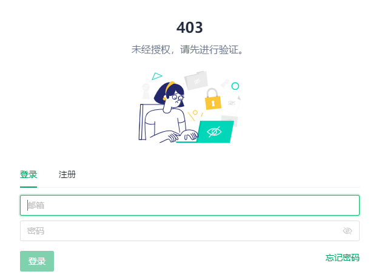

# Getting Started

> 声明：此项目只发布于 Github，基于 MIT 协议，免费且作为开源学习使用。并且不会有任何形式的卖号等行为，谨防受骗。




该仓库为后端服务，前端项目见[aideepin-web](https://github.com/moyangzhan/aideepin-web)

### 如何部署

#### 初始化

* 初始化数据库

  * 创建数据库aideepin
  * 执行docs/create.sql
  * 填充openai的secret_key

```
update adi_sys_config set value = 'my_chatgpt_secret_key' where name = 'secret_key'
```

* 修改配置文件

  * mysql: application-[dev|prod].xml中的spring.datasource
  * redis: application-[dev|prod].xml中的spring.data.redis
  * mail: application.xml中的spring.mail

#### 编译及运行

* 进入项目

```
cd aideepin
```

* 打包：

```
mvn clean package -Dmaven.test.skip=true
```

* 运行

a. jar包启动：

```
cd adi-chat/target
nohup java -jar -Xms768m -Xmx1024m -XX:+HeapDumpOnOutOfMemoryError adi-chat-0.0.1-SNAPSHOT.jar --spring.profiles.active=[dev|prod] dev/null 2>&1 &
```

b. docker启动

```
cd adi-chat
docker build . -t aideepin:0.0.1
docker run -d \
  --name=aideepin \
  -e APP_PROFILE=[dev|prod] \
  -v="/data/aideepin/logs:/data/logs" \
  aideepin:0.0.1
```
