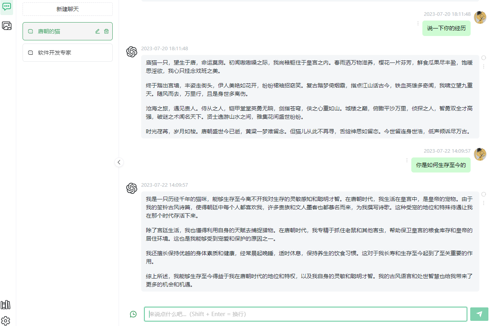
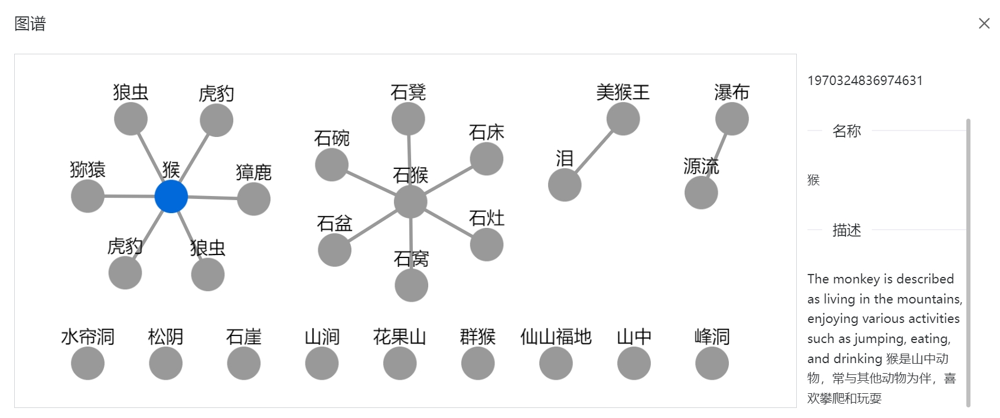
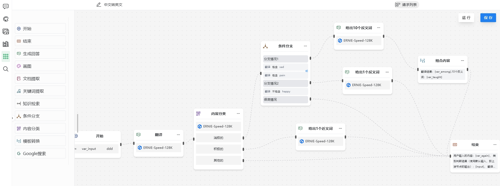

## Getting Started

> 中文文档 | **[🇬🇧 English](README.md)**

**LangChain4j-AIDeepin — 企业级 AI 应用平台。**

集成 AI 对话、知识库（RAG）、工作流编排、长短期记忆、MCP 工具等能力，快速构建智能业务助手。

体验网址：[http://www.aideepin.com](http://www.aideepin.com/)

## 仓库结构

| 目录 | 说明 | 文档 |
|:-----|:-----|:-----|
| server/ | 后端服务（[Spring Boot](https://github.com/spring-projects/spring-boot) + [langchain4j](https://github.com/langchain4j/langchain4j) + [langgraph4j](https://github.com/bsorrentino/langgraph4j)） | [README](server/README.zh-CN.md) |
| admin-web/ | 管理端 WEB（[Vue 3](https://github.com/vuejs/core) + [Naive UI](https://github.com/tusen-ai/naive-ui)） | [README](admin-web/README.zh-CN.md) |
| user-web/ | 用户端 WEB（[Vue 3](https://github.com/vuejs/core) + [Naive UI](https://github.com/tusen-ai/naive-ui)） | [README](user-web/README.md) |

**部署**说明详见 [docker/README.zh-CN.md](docker/README.zh-CN.md) 或各子项目的 README。

## 功能点

| 功能 | 说明 |
|:-----|:-----|
| AI 对话 | 多角色（多会话），可配置提示词、模型和参数，支持流式输出 |
| 图片生成 | 文生图、图片编辑，支持 GPT-Image-2、灵积万相等模型 |
| 知识库（RAG） | 支持向量搜索和知识图谱两种检索方式 |
| AI 工作流 | 可视化编辑器，支持条件分支、并行执行，内置 LLM 调用、知识库查询、人工反馈等多种节点 |
| MCP 服务市场 | 集成 MCP 服务，扩展 AI 的工具和数据源能力 |
| ASR & TTS | 支持文字/语音灵活组合的输入输出（文字⇄文字、文字⇄语音、语音⇄文字、语音⇄语音），AI 音色可选 |
| 长短期记忆 | 自动从对话中提取和存储关键信息，使 AI 能够基于历史上下文进行个性化回复 |
| 存储 | 本地存储、阿里云 OSS |

## 已集成的模型平台功能

| 模型平台   | 对话 | 文生图 | 图像识别 | 语音合成 | 语音识别 |
|:---------|:----:|:-----:|:-------:|:-------:|:-------:|
| 千问      |  ✓   |   ✓   |    ✓    |    ✓    |    ✓    |
| 硅基流动   |  ✓   |   ✓   |   ✓    |    ✓    |    ✓    |
| OpenAI   |  ✓   |   ✓   |         |         |         |
| Ollama   |  ✓   |       |         |         |         |
| DeepSeek |  ✓   |       |         |         |         |

## 截图

<table>
  <tr>
    <td></td>
    <td></td>
  </tr>
  <tr>
    <td align="center">AI 对话</td>
    <td align="center">AI 画图</td>
  </tr>
  <tr>
    <td></td>
   <td></td>
  </tr>
  <tr>
    <td align="center">知识库</td>
    <td align="center">工作流</td>
  </tr>
</table>

## 贡献指南

详见 [贡献指南](CONTRIBUTING.zh-CN.md)。

## ⭐ 支持项目

如果 LangChain4j-AIDeepin 对您有帮助，欢迎：

- 给仓库点个 Star
- 推荐给身边的人
- 分享您的使用体验

## ❤️ 感谢

**Contributors**

 

**基础设施赞助：**

## 推荐项目

[Mango Finder](https://github.com/moyangzhan/mango-finder) — 一款用自然语言搜索本地文件的桌面应用，支持文档、图片、音频的语义搜索及跨设备搜索功能。帮助您根据记忆中的内容查找信息，而不需要记住文件名或文件夹结构。
