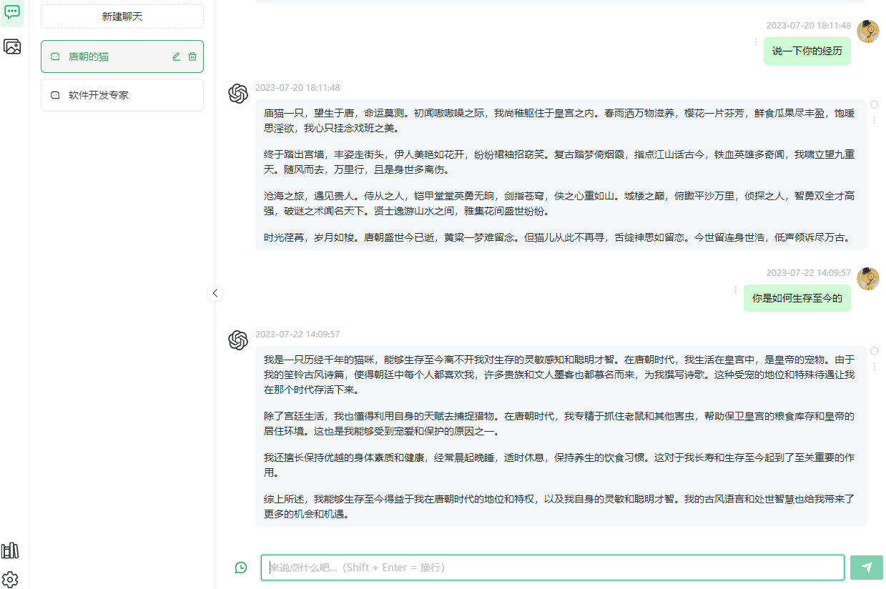
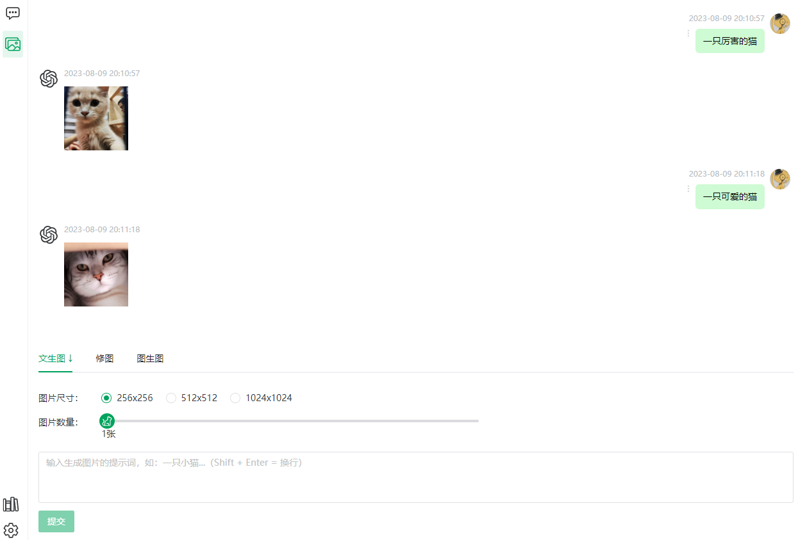
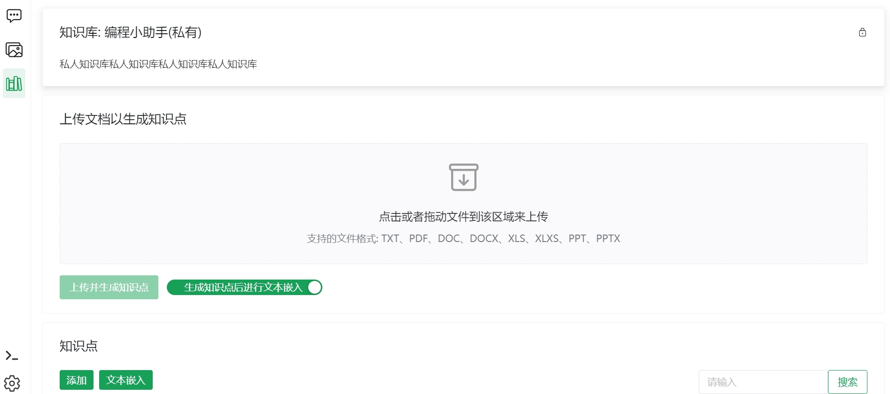

## Getting Started

[中文](README.md)

**LangChain4j-AIDeepin**
Langchain4j-aideepin is an open source, offline deployable Retrieval Enhancement Generation (RAG) project based on large language models such as ChatGPT and application frameworks such as Langchain4j.

## Website

[http://www.aideepin.com](http://www.aideepin.com/)

## Feature

* Login & Register
* Multiple Conversation | Multiple character
* AI Draw
* Prompt
* Quota
* Knowledge base(RAG)
* AI Search(RAG)
* Multiple models switch at will
* Multiple search engine switch at will

## Support Models

* ChatGPT 3.5
* 通义千问
* 文心一言
* ollama
* DALL-E 2

## Support Search Engines

Google

Bing (TODO)

百度 (TODO)

## Introduction

This repository is a back-end project, front-end project in [langchain4j-aideepin-web](https://github.com/moyangzhan/langchain4j-aideepin-web)

Backend：

jdk17

springboot3.0.5

[langchain4j(Java version of LangChain)](https://github.com/langchain4j/langchain4j)

**Postgresql(Need plugin [pgvector](https://github.com/pgvector/pgvector))**

Frontend：

vue3+typescript+pnpm

## Build and run this project

### Init

**a. Init database**

* Create database schema: aideepin
* Run: docs/create.sql
* Update language model config:

Openai setting

```plaintext
update adi_sys_config set value = '{"secret_key":"my_openai_secret_key","models":["gpt-3.5-turbo"]}' where name = 'openai_setting';
```

Dashscope setting

```plaintext
update adi_sys_config set value = '{"api_key":"my_dashcope_api_key","models":["my model name,eg:qwen-max"]}' where name = 'dashscope_setting';
```

Qianfan setting

```plaintext
update adi_sys_config set value = '{"api_key":"my_qianfan_api_key","secret_key":"my_qianfan_secret_key","models":["my model name,eg:ERNIE-Bot"]}' where name = 'qianfan_setting';
```

Ollama setting

```
update adi_sys_config set value = '{"base_url":"my_ollama_base_url","models":["my model name,eg:tinydolphin"]}' where name = 'ollama_setting';
```

* Search engine setting

Google:

```
update adi_sys_config set value = '{"url":"https://www.googleapis.com/customsearch/v1","key":"my key from cloud.google.com","cx":"my cx from programmablesearchengine.google.com"}' where name = 'google_setting';
```


**b. Init properties**

* postgresql: spring.datasource in application-[dev|prod].xml
* redis: spring.data.redis in application-[dev|prod].xml
* mail: spring.mail in application.xml

### Compile & Run

* Enter the project root directory:

```plaintext
cd langchain4j-aideepin
```

* Package：

```
mvn clean package -Dmaven.test.skip=true
```

* Run:

a. Run by jar：

```plaintext
cd adi-bootstrap/target
nohup java -jar -Xms768m -Xmx1024m -XX:+HeapDumpOnOutOfMemoryError adi-chat-0.0.1-SNAPSHOT.jar --spring.profiles.active=[dev|prod] dev/null 2>&1 &
```

b. Run by docker

```plaintext
cd adi-bootstrap
docker build . -t aideepin:0.0.1
docker run -d \
  --name=aideepin \
  -e APP_PROFILE=[dev|prod] \
  -v="/data/aideepin/logs:/data/logs" \
  aideepin:0.0.1
```

## TODO：

Advanced RAG

More search engine（BING、百度）

## Screenshot

**AI Chat：**


**AI Draw：**



**Knowlege base：**




**Embedding：**


**Quota：**

!
