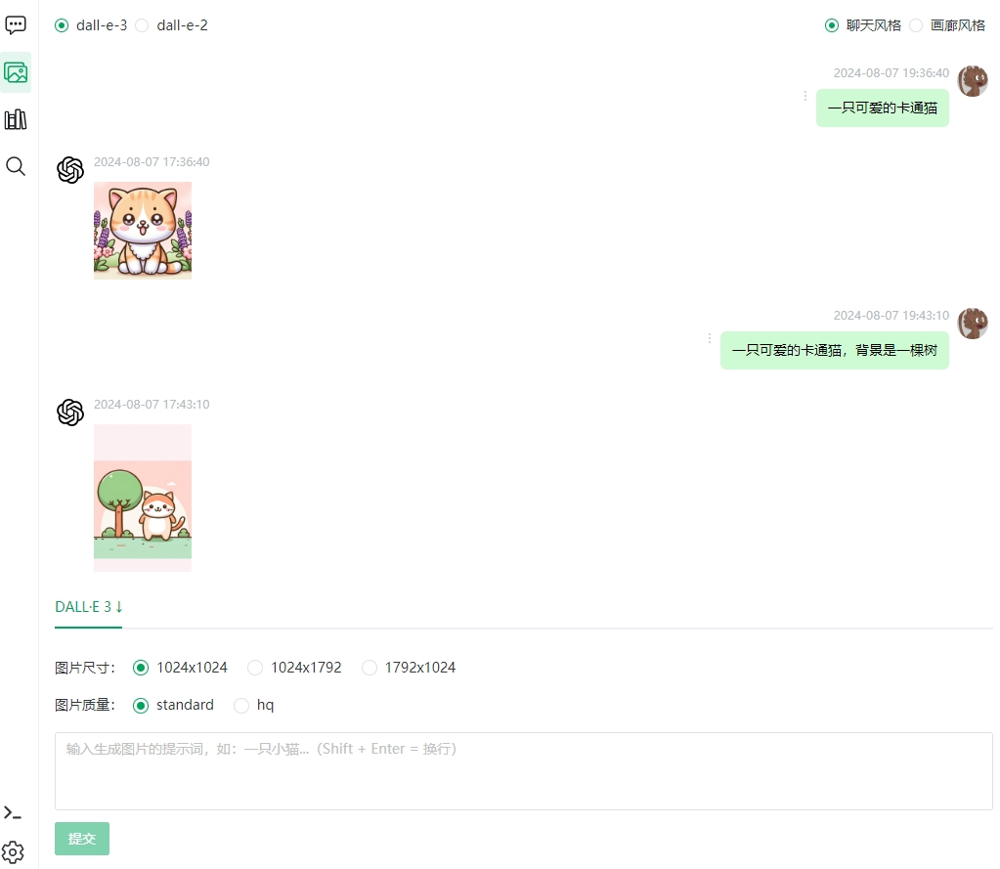
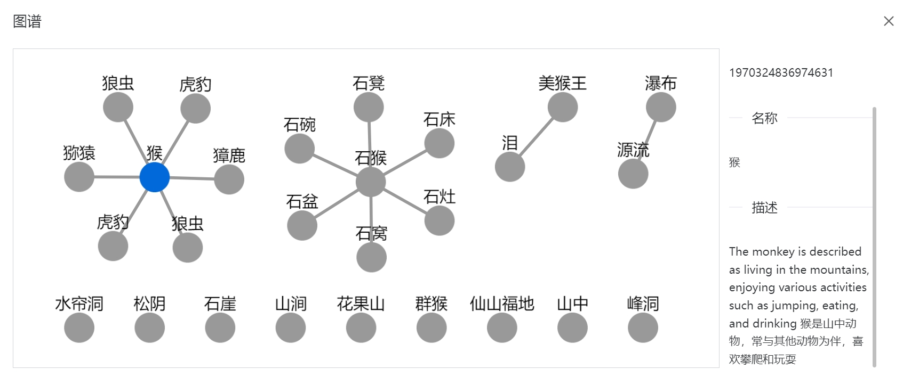

## Getting Started

**LangChain4j-AIDeepin is an AI-based productivity enhancement tool.**

*It can be used to assist enterprises/teams in technical research and development, product design, HR/finance/IT information consulting, system/product consulting, customer service support, etc.*

> **🌟 If this project is helpful to you, please give it a star 🌟**

## System Composition and Documentation

[中文文档](README.md) | [English](README_en.md)

AIDEEPIN

&nbsp;&nbsp;&nbsp;&nbsp;&nbsp;&nbsp;|__ Server (langchain4j-aideepin)

&nbsp;&nbsp;&nbsp;&nbsp;&nbsp;&nbsp;|__ User Web (langchain4j-aideepin-web)

&nbsp;&nbsp;&nbsp;&nbsp;&nbsp;&nbsp;|__ Admin Web (langchain4j-aideepin-admin)

👉[Detailed Documentation](https://github.com/moyangzhan/langchain4j-aideepin/wiki)

Backend source repository: [github](https://github.com/moyangzhan/langchain4j-aideepin) or [gitee](https://gitee.com/moyangzhan/langchain4j-aideepin)

Frontend projects:

* User Web: langchain4j-aideepin-web
    * [github](https://github.com/moyangzhan/langchain4j-aideepin-web)
    * [gitee](https://gitee.com/moyangzhan/langchain4j-aideepin-web)
* Admin Web: langchain4j-aideepin-admin
    * [github](https://github.com/moyangzhan/langchain4j-aideepin-admin)
    * [gitee](https://gitee.com/moyangzhan/langchain4j-aideepin-admin)

## Demo URL

[http://www.aideepin.com](http://www.aideepin.com/)

## Features

* Multi-session (multi-role)
* Image generation (text-to-image, image editing, image-to-image)
* Knowledge base based on large models (RAG)
  * Vector search
  * Graph search
* Network search based on large models (RAG)
* AI workflow
* MCP service marketplace

## Integrated Models:

* DeepSeek
* ChatGPT 3.5
* 通义千问
* 文心一言
* siliconflow
* Ollama
* DALL-E 2
* DALL-E 3

## Integrated Search Engines

Google

Bing (TODO)

Baidu (TODO)

## Tech Stack

This repository is for the backend service

Tech stack:

* jdk17
* springboot3.0.5
* [langchain4j(Java version of LangChain)](https://github.com/langchain4j/langchain4j)
* [langgraph4j](https://github.com/bsorrentino/langgraph4j)
* Postgresql
    * pgvector extension: https://github.com/pgvector/pgvector
    * Apache AGE extension: https://github.com/apache/age
* [neo4j](https://neo4j.com/deployment-center/)

Frontend tech stack:

* vue3
* vite
* typescript
* pnpm
* pinia
* naiveui

## How to Deploy

### Initialization

**a. Initialize the database**

* Create the database `aideepin`
* Execute `docs/create.sql`
* Configure models (at least set one) or use the [admin web](https://github.com/moyangzhan/langchain4j-aideepin-admin) to configure on the interface

    * Configure AI platforms
      ```plaintext

      -- DeepSeeksecretKey
        update adi_sys_config set value = '{"base_url":"https://api.deepseek.com","secret_key":"my_deepseek_secret_key"}' where name = 'deepseek_setting';

      -- OpenAI secretKey
      update adi_sys_config set value = '{"secret_key":"my_openai_secret_key"}' where name = 'openai_setting';
  
      -- Dashscope API key
      update adi_sys_config set value = '{"api_key":"my_dashcope_api_key"}' where name = 'dashscope_setting';

      --siliconflow secret key
      update adi_sys_config set value = '{"base_url":"https://api.siliconflow.cn","secret_key":"my_siliconflow_api_key"}' where name = 'siliconflow_setting';
  
      -- Qianfan API key and secret key
      update adi_sys_config set value = '{"api_key":"my_qianfan_api_key","secret_key":"my_qianfan_secret_key"}' where name = 'qianfan_setting';
  
      -- Ollama configuration
      update adi_sys_config set value = '{"base_url":"my_ollama_base_url"}' where name = 'ollama_setting';
      ```
    * Enable AI platform models or add new models
      ```
      -- Enable model
      update adi_ai_model set is_enable = true where name = 'deepseek-chat';
      update adi_ai_model set is_enable = true where name = 'gpt-3.5-turbo';
      update adi_ai_model set is_enable = true where name = 'dall-e-2';
      update adi_ai_model set is_enable = true where name = 'qwen-turbo';
      update adi_ai_model set is_enable = true where name = 'THUDM/GLM-Z1-9B-0414';
      update adi_ai_model set is_enable = true where name = 'ernie_speed';
      update adi_ai_model set is_enable = true where name = 'tinydolphin';
  
      -- Add new model
      INSERT INTO adi_ai_model (name, type, platform, is_enable) VALUES ('vicuna', 'text', 'ollama', true);
      ```
* Fill in the search engine configuration

    * Google configuration
      ```
      update adi_sys_config set value = '{"url":"https://www.googleapis.com/customsearch/v1","key":"my key from cloud.google.com","cx":"my cx from programmablesearchengine.google.com"}' where name = 'google_setting';
      ```

**b. Modify the configuration file**

+ PostgreSQL: `spring.datasource` in `application-[dev|prod].xml`
+ Redis: `spring.data.redis` in `application-[dev|prod].xml`
+ Email: `spring.mail` in `application.xml`
+ Vector database, default is pgvector:
  * `adi.vector-database=[pgvector|neo4j]` in `application-[dev|prod].xml`
+ Graph database, default is Apache AGE:
  * `adi.graph-database=[apache-age|neo4j]` in `application-[dev|prod].xml`

### Build and Run

* Enter the project

  ```plaintext
  cd langchain4j-aideepin
  ```
* Package:

  ```
  mvn clean package -Dmaven.test.skip=true
  ```
* Run

    * Start with jar:

  ```plaintext
  cd adi-bootstrap/target
  nohup java -jar -Xms768m -Xmx1024m -XX:+HeapDumpOnOutOfMemoryError adi-bootstrap-0.0.1-SNAPSHOT.jar --spring.profiles.active=[dev|prod] dev/null 2>&1 &
  ```

    * Start with docker

  ```plaintext
  cd adi-bootstrap
  docker build . -t aideepin:0.0.1
  docker run -d \
    --name=aideepin \
    -e APP_PROFILE=[dev|prod] \
    -v="/data/aideepin/logs:/data/logs" \
    aideepin:0.0.1
  ```

## TODO:

* Advanced RAG
    * Query compression  √
    * Query routing
    * Re-rank: support local rerank model
* AI Chat
    * Multi-role  √
    * Preset general roles (created in admin backend)  √
* Image Models:
    * DALL-E 2 & DALL-E 3 √
    * Chat view  √
    * Gallery view  √
    * Open/collect images √ 
    * Image comments √
* Knowledge Base:
    * Vector  √
    * Knowledge graph  √
    * Set the number of document recalls
        * Auto-adjust (based on LLM context window size)  √
        * Manual adjustment  √
    * Set the minimum score for document recall  √
    * Set the overlap number when chunking  √
    * Set temperature when requesting model  √
    * Strict mode and non-strict mode  √
    * Answer source  √
    * Support fetching online documents
    * FAQ
    * Comments
* Multi-modal support
    * Image  √
    * Audio
    * Video
* Tools
    * FAQ extraction
    * Document conversation
    * Translation
    * Image processing
      * Image editing
      * Image matting
      * Image expansion
      * Image synthesis
      * Background switching
* Search Engines
    * Google  √
    * Bing
    * Baidu
* Quota statistics and control
    * Free quota statistics and limits
    * Paid quota statistics and limits
    * Total quota statistics
* Open API

## Screenshots

**AI Chat:**


**AI Drawing:**




**Knowledge Base:**


**Vectorization:**


**Knowledge Graph:**




**Quota Statistics:**

