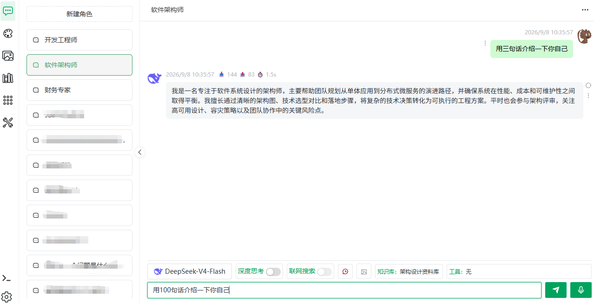
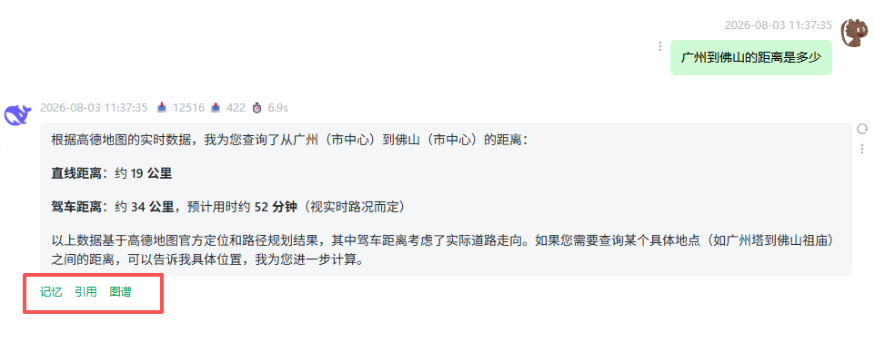

# 对话界面

> [← 使用指南](../index.md) · [English](../../../en/guide/chat/window.md)

对话界面分为三块：左侧**角色列表**、中间**消息区**、底部**输入区**。每个角色拥有独立的对话历史，切换角色即切换会话。

<figure>
  
  <figcaption>对话界面</figcaption>
</figure>

## 发送消息与流式回答

1. 在输入框输入问题。
2. 回车（或点击发送按钮）提交。
3. 回答流式输出。发送后到回答完成前，消息区会依次显示状态提示：**问题分析中 → 知识库搜索中（关联了知识库时）→ 推理中 → 回答中**。
4. 生成过程中可点击**停止请求**中断；中断后可重新生成。

> [!TIP]
> 消息区底部有**滚动到底部**按钮，长对话中随时可以快速回到底部。

### 深度思考

操作：点击输入栏的**深度思考**开关图标，高亮即开启。

- 开启后回答会先展示思考过程，再给出最终答案，适合数学、推理、代码类问题；
- 部分模型（如 deepseek-reasoner）始终开启深度思考且不可关闭；也有些模型不支持深度思考，开关会禁用并提示「模型不支持深度思考功能」；
- 角色级也可以设置默认开关，见[角色进阶设置](character-config.md#深度思考)。

### 联网搜索

操作：点击输入栏的**联网搜索**开关图标。

- 开启后回答会参考搜索引擎的结果，适合时效性问题；
- 是否可用由模型能力决定。

> [!WARNING]
> DeepSeek 模型的深度思考与工具 / 联网搜索互斥：同时开启时系统会自动关闭其一并给出提示。

### 多答案对比

对同一问题**重新生成**回答后，多个回答会以「回答 1 / 回答 2 …」页签并列展示，点击页签切换对比，择优采纳。

## 消息操作

悬浮消息（或消息下方按钮组）可用：

| 操作 | 说明 |
|---|---|
| 复制 / 复制代码 | 复制回答全文或其中的单个代码块 |
| 删除消息 | 删除问题会**同时删除对应的回答**，需二次确认 |
| 重新生成 | 对该问题重新发起一次回答（配合页签形成多答案） |

## 上传图片（图像识别）

1. 确认模型选择器中选中的是**视觉（多模态）模型**——纯文本模型下该按钮不可用（悬浮提示「模型不支持图片识别」）；
2. 点击输入栏的上传图片按钮（悬浮提示「上传图片以识别其内容」），选择本地图片；
3. 图片随问题一并发送，AI 将识别图片内容并作答。

| 限制 | 值 |
|---|---|
| 格式 | PNG、JPG |
| 单张大小 | ≤ 4MB |
| 入口可见性 | 仅视觉模型显示 |

## 输入栏的知识库与工具标签

不进入角色编辑也能即时调整当前角色的关联资源：

- **知识库**：点击「知识库：」标签条，弹窗中勾选 / 取消知识库，保存即时生效；
- **工具**：点击「工具：」标签条，弹窗中配置 MCP 工具。

> [!NOTE]
> 两处修改只影响当前角色，与[角色进阶设置](character-config.md)表单中的配置等价、双向同步。

## 上下文理解

输入栏的**上下文**图标决定发送时是否携带历史消息（悬浮提示「上下文理解已开启 / 已关闭」）：

| 状态 | 行为（切换时的提示原文） | 适合 |
|---|---|---|
| 开启（默认） | 「当前模式下, 发送消息会携带之前的聊天记录」 | 多轮追问、连续任务 |
| 关闭 | 「当前模式下, 发送消息不会携带之前的聊天记录」 | 批量单问、节省 Token |

## 记忆与引用

每条回答下方有三个按钮，用于回答溯源：

| 按钮 | 内容 |
|---|---|
| 记忆 | 展示本次回答命中的长期记忆，按**语义记忆** / **情景记忆**分组 |
| 引用 | 展示命中的知识库片段。按文档分段模式展示：问答模式显示命中的问题与答案；父子分段模式显示命中的子块及其父段；通用分段显示段文本 |
| 图谱 | 展示本次回答参考的知识图谱片段 |

<figure>
  
  <figcaption>引用资料</figcaption>
</figure>

> [!TIP]
> 「引用」为空说明本次回答未命中知识库内容（或角色未关联知识库）。想让回答有据可查，先阅读[知识库概览](../knowledge-base/overview.md)。

## 语音输入

点击输入栏话筒图标即可语音提问，录音自动转文字发送——完整说明见[语音输入与播报](voice.md)。

## 顶栏更多操作

- **编辑**：打开当前角色的编辑表单（等同左侧列表悬浮的铅笔图标）；
- **API**：查看 / 管理该角色的开放 API Key 与接口文档，详见 [API 参考 · 角色对话](../../api/character.md)。

---

上一篇：[快速开始](../quick-start.md) ｜ 下一篇：[角色管理与预设角色](character.md)
