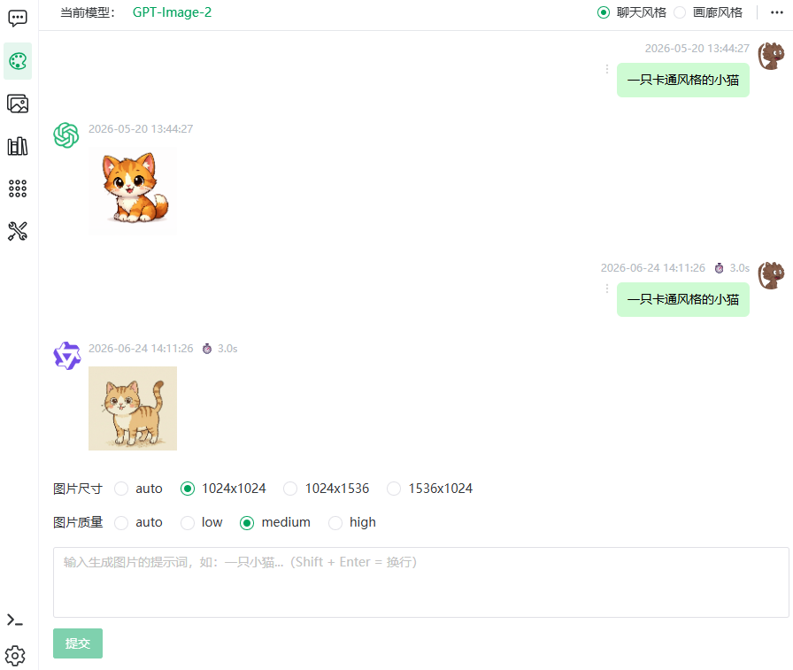
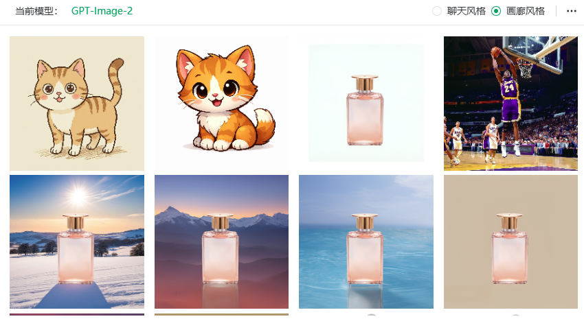
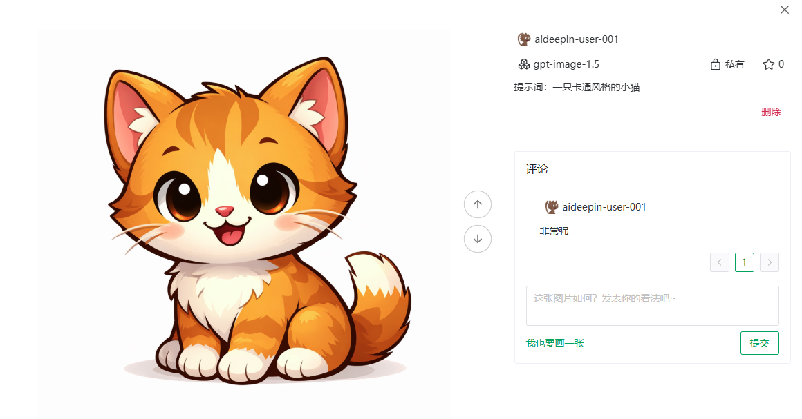

# 绘画

> [← 使用指南](../index.md) · [English](../../../en/guide/draw/draw.md)

进入**绘画**页面后，顶部可选择图片模型，中部为提示词编辑器（按所选模型平台切换形态），下方为**我的绘图记录**。

<figure>
  
  <figcaption>绘画页（聊天风格）</figcaption>
</figure>

<figure>
  
  <figcaption>绘画页（画廊风格）</figcaption>
</figure>

## 生成流程

1. 在顶部的图片模型选择器中挑选模型——**不同平台对应不同编辑器**，切换模型后编辑器形态随之变化；
2. 在提示词输入框描述想要的画面（中英文均可）；
3. 按需调整编辑器参数（尺寸、数量、种子等，见下节）；
4. 点击生成，任务异步提交；
5. 完成后图片出现在**我的绘图记录**中，任务执行期间可离开页面，回来后在记录中查看结果。

## 各平台编辑器参数

### OpenAI（gpt-image）

| 参数 | 可选值 |
|---|---|
| 图片尺寸 | auto（自动）/ 方形 1024x1024 / 竖屏 1024x1536 / 横屏 1536x1024 |
| 图片质量 | auto / low / medium / high（越高越精细，耗时与成本相应增加） |

### 通义万相（DashScope）

**文生图**：

| 参数 | 说明 |
|---|---|
| 图片尺寸 | 由所选模型的配置决定 |
| 图片数量 | 一次生成的张数（滑杆 1–4 张） |
| 随机种子 | 指定种子可复现结果；勾选「随机生成」则每次不同 |

**背景生成**（为主图生成新背景）。展开「使用说明」可见官方说明：

> 主体图片：给该图片生成背景的主图，不可为空
> 引导图片：给AI参考的图片
> 提示词：背景描述
> 引导图片与提示词至少选择一个

| 参数 | 必填 | 界面提示原文 |
|---|---|---|
| 主图 | 是 | 问号：「背景透明的图像（带透明背景的RGBA四通道图像）」；上传区：PNG图片，图像长边不超过2048像素 |
| 引导图 | 否 | 问号：「图像要求：jpg、png、webp等常见格式。引导图像可以是 RGB 图像或带透明背景的 RGBA 图像。对于RGBA图像，Alpha通道值为0的区域将不参与引导过程的生成，适用于带有主体的引导图。」 |
| 提示词 | 否 | 背景描述（与引导图至少填一项，否则提示「请上传引导图或填写提示词」） |

> [!WARNING]
> 背景生成依赖图片的**公网可访问性**：模型需要通过公网获取主体图片及引导图片——开启阿里云 OSS 存储时需确保图片访问权限为公共读；使用本地存储时需确保上传的主图及引导图可公网访问（本地开发时本功能不可用）。OSS 的开启位置：管理后台 → 系统配置 → 存储位置。

### SiliconFlow（硅基流动）

| 参数 | 说明 |
|---|---|
| 图片尺寸 | 从模型属性动态读取 |
| 随机种子 | -1 表示随机 |

## 我的绘图记录

- 列表按时间倒序，**无限上拉加载**，底部提示「没有更多了」。
- 点击记录进入**绘图详情**：
  - 查看提示词与引用图片（原图 / 引导图）；
  - 翻看**评论**、点赞；
  - **我也要画一张**：带入该提示词跳转编辑器再创作；
  - **上一个 / 下一个**绘图记录导航，连续翻看。

<figure>
  
  <figcaption>绘图详情</figcaption>
</figure>

### 管理操作

在绘图记录上操作：

| 操作 | 位置 | 说明 |
|---|---|---|
| 删除绘图任务 | 记录更多菜单 | 删除该提示词及其生成的**全部图片**（确认弹窗会列明将删除的内容） |
| 删除单张图片 | 图片上 | 只删该图，保留提示词与其余图片 |
| 公开 / 私有切换 | 记录上 | 公开后图片进入画廊供所有人浏览（提示「可以公开访问」），关闭则恢复私有（「关闭外部访问权限」） |

> [!TIP]
> 想让作品被更多人看到：设为公开后，可在[画廊](gallery.md)的「公开图片」中找到它，并接受评论与点赞。

## API

顶栏**更多 → API** 可生成绘图 API Key 并查看接口文档，把文生图接入你自己的程序（创建任务 + 轮询结果两个接口），详见 [API 参考 · 绘图任务](../../api/draw.md)。

---

上一篇：[语音输入与播报](../chat/voice.md) ｜ 下一篇：[画廊](gallery.md)
