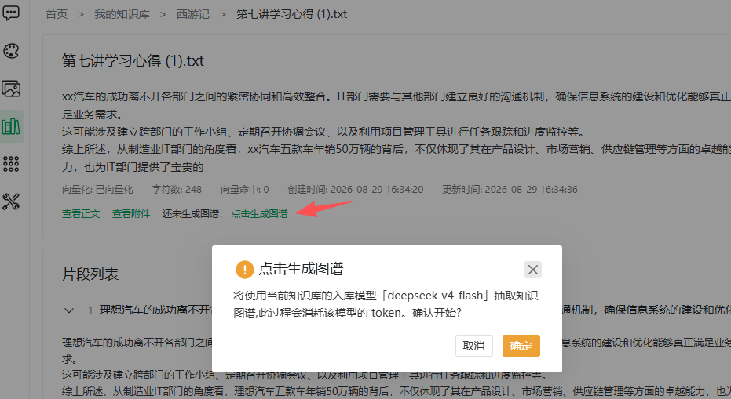
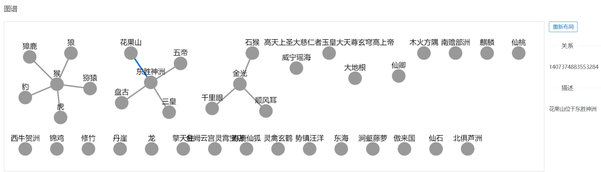

# 知识图谱

> [← 使用指南](../index.md) · [English](../../../en/guide/knowledge-base/graph.md)

知识图谱索引从文档中抽取**实体（节点）**与**关系（边）**，与向量索引互补：向量按语义相似度召回，图谱按实体关系组织，适合多跳关联类问题（如「A 产品线的负责人所在的部门有哪些制度」）。

## 生成图谱

图谱以**文档**为单位抽取，消耗知识库[入库模型](manage.md#_3-文档索引设置-模型)的 Token。三个入口：

| 入口 | 位置 |
|---|---|
| 索引弹窗勾选「图谱化」 | 导入文档时的[索引弹窗](document.md#建立索引) |
| **图谱**按钮 | 文档列表操作列（未图谱化时禁用） |
| 「点击生成图谱」 | [分段管理](segment.md)页文档卡片 |

以分段管理页为例：

1. 点击「点击生成图谱」；
2. 确认提示会注明所用模型：「将使用当前知识库的入库模型「{model}」抽取知识图谱…确认开始?」；
3. 图谱状态显示**图谱抽取中**（后台任务），完成后自动刷新。

<figure>
  
  <figcaption>图谱确认弹窗</figcaption>
</figure>

## 查看图谱

1. 在文档列表或分段管理页点击**查看图谱**，进入该文档的图谱页面；
2. 画布上展示节点与关系；
3. 大图分页加载：底部显示「节点 {已加载}/{总数}，关系 {已加载}/{总数}」，点击**加载更多**继续；
4. 状态异常时页面给出提示（「图谱抽取中，完成后刷新查看」或「暂无图谱数据」）。

<figure>
  
  <figcaption>知识图谱</figcaption>
</figure>

## 图谱在回答中的引用

对开启了图谱索引的知识库提问后：

1. 回答完成后点击下方的**图谱**按钮；
2. 弹窗展示本次回答参考的图谱片段（引用图谱）。

对话中关联知识库的角色同样支持。配合**引用**（命中片段）可以完整追溯回答依据，见[对话界面 · 记忆与引用](../chat/window.md#记忆与引用)。

## 维护提示

> [!WARNING]
> 图谱**不会随正文修改自动更新**：切换分段模式或编辑正文后，需手动重新抽取图谱，否则回答仍在引用旧图谱。

- 停用片段会同时删除其图谱足迹；重新启用后如需图谱，需再次抽取（见[分段管理 · 片段启停](segment.md#片段启停-各模式通用)）；
- 图谱化成本与文档长度正相关，建议优先对实体密集的资料（组织架构、产品参数、制度条款）建图谱，叙述性文本只做向量索引即可。

---

上一篇：[分段管理](segment.md) ｜ 下一篇：[知识库问答](kb-qa.md)
