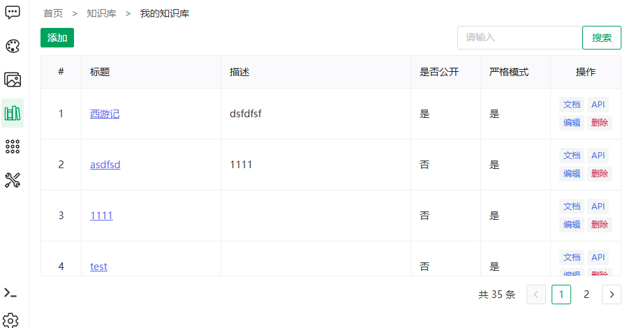
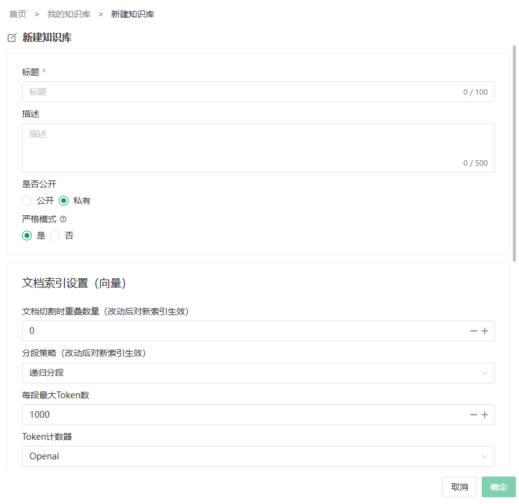

# 创建与设置知识库

> [← 使用指南](../index.md) · [English](../../../en/guide/knowledge-base/manage.md)

进入**知识库 → 知识库管理**（或直接访问「我的知识库」页面），这里是知识库的总览：表格列出**标题（链接进详情）、描述、是否公开、是否严格**，操作列提供**文档 / API / 编辑 / 删除**。

- 顶部搜索框按标题过滤（输入后回车或点击搜索按钮）；
- 表格底部分页，显示「共 {n} 条」。

<figure>
  
  <figcaption>我的知识库</figcaption>
</figure>

## 新建知识库

1. 点击**添加**，进入建库 / 编辑表单（共五组设置卡片）；
2. 按下文说明填写各组参数；
3. 点击保存，回到列表页即可看到新库。

> [!TIP]
> 首次建库只需填**标题**，其余保持默认即可开始导入文档；切段与召回参数后续随时可改（修改切段参数会触发索引重建，见文末）。

### 1. 基本信息

| 字段 | 必填 | 说明 |
|---|---|---|
| 标题 | 是 | 知识库名称 |
| 描述 | 否 | 用途说明，公开后其他人也能看到 |
| 是否公开 | 否，默认私有 | 公开：所有人可见可用；私有：仅创建者 |
| 严格模式 | 否，默认宽松 | 问号提示原文：「严格模式：严格匹配知识库，知识库中如无搜索结果，直接返回无答案；宽松模式：知识库中如无搜索结果，则将用户提问传给LLM继续请求答案。」详见[概览](overview.md#严格模式与宽松模式) |

### 2. 文档索引设置（向量）

| 字段 | 说明 |
|---|---|
| 文档切割时重叠数量 | 相邻片段重叠的字符量（标注「改动后对新索引生效」）。适当重叠可避免关键信息恰好被切断在边界上 |
| 分段策略 | 递归分段 / 按段落 / 按行 / 按句 / 自定义分隔符（选自定义时必须输入分隔符，如 `\n\n`、`\n`） |
| 每段最大 Token 数 | 单个片段的上限，超长段落会被继续切分 |
| Token 计数器 | OpenAI / 通义千问 / Huggingface 三种估算口径，建议与所用的向量模型家族一致 |

> [!TIP]
> 「按段落」适合结构规整的文档；「递归分段」是通用默认；表格、日志类内容可尝试「按行」或自定义分隔符。

### 3. 文档索引设置（模型）

**模型名称**：问号提示原文——

> 图谱抽取、生成QA时使用的模型，为空则使用第一个可用的模型

> [!WARNING]
> 图谱化和 QA 生成**都会消耗该模型的 Token**。请选择成本可控的模型；留空时自动使用第一个可用模型。

### 4. 文档召回设置

| 字段 | 说明 |
|---|---|
| 文档召回最大数量 | 每次检索最多召回的片段数。调高更全面但增加 Token 消耗 |
| 文档召回最小分数 | 相似度低于该阈值的片段不参与回答。调高更严格、噪音更少 |

### 5. 大模型参数设置

| 字段 | 说明 |
|---|---|
| 系统提示词 | 知识库问答时的角色设定（如「你是公司制度助手，回答必须基于检索内容」） |
| 创造性 / 随机性 | 回答温度（temperature）：越低越保守，越高越发散 |

<figure>
  
  <figcaption>建库表单</figcaption>
</figure>

## 编辑知识库

列表操作列点击**编辑**进入同一表单。注意两类修改的后果：

| 修改 | 后果 |
|---|---|
| 召回设置、LLM 参数 | 即时生效，无需重建 |
| 切段参数（重叠 / 策略 / 最大 Token 等） | 保存时提示「切段参数变更将自动重建该知识库全部文档的向量索引，确定保存吗？」——确认后系统**自动重建全部索引**，文档多时耗时较长 |

## API

列表操作列的**API** 按钮可生成该知识库的 API Key 并查看接口文档，详见 [API 参考 · 知识库问答](../../api/knowledge-base.md)。

## 删除知识库

1. 列表操作列点击**删除**；
2. 二次确认「删除后数据无法恢复，确定要删除知识库【{标题}】吗?」。

> [!WARNING]
> 删除后文档、片段、向量与图谱一并清除，**不可恢复**。已关联该库的角色将失去其检索能力。

---

上一篇：[知识库概览](overview.md) ｜ 下一篇：[导入文档](document.md)
