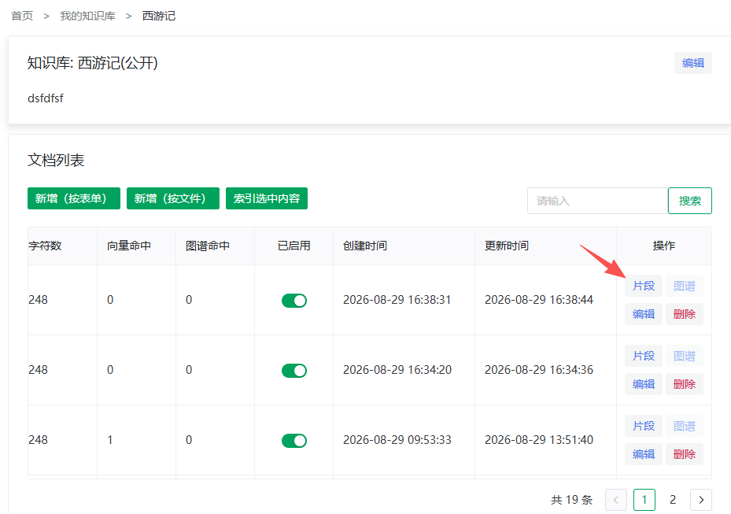
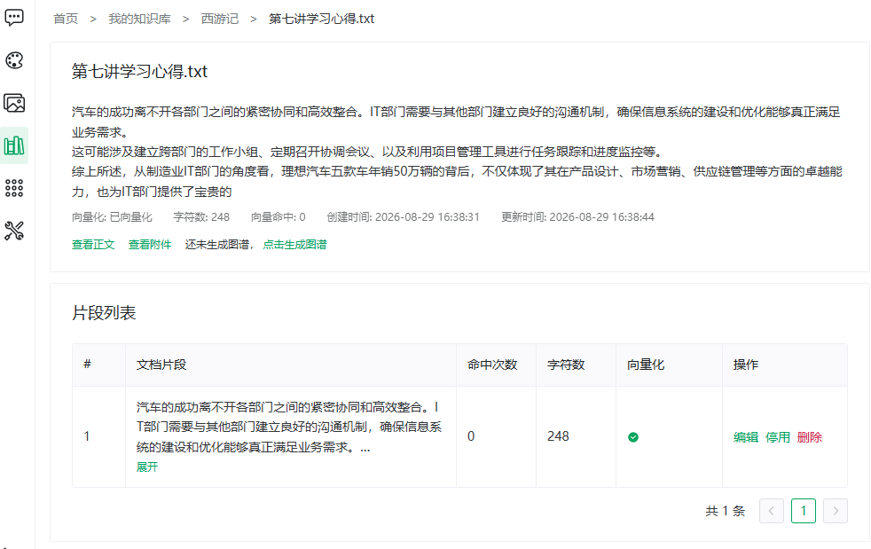

# 分段管理

> [← 使用指南](../index.md) · [English](../../../en/guide/knowledge-base/segment.md)

从文档列表的**片段**操作进入片段（问答对）管理页。页面顶部是文档卡片，下方按文档的分段模式展示三种列表之一。

**文档卡片**：摘要、向量化状态、字符数、向量命中与时间，以及三个入口：

| 入口 | 说明 |
|---|---|
| 查看正文 | 只读查看，可跳转编辑 |
| 查看附件 | 预览原始上传文件 |
| 生成图谱 / 查看图谱 | 未图谱化时显示「还未生成图谱，**点击生成图谱**」；已图谱化则显示**查看图谱**（见[知识图谱](graph.md)） |

<figure>
  
  <figcaption>从文档列表进入分段管理</figcaption>
</figure>

<figure>
  
  <figcaption>分段管理页面</figcaption>
</figure>

分段管理页按文档的**分段模式**呈现对应的列表与操作——**通用分段**、**问答**、**父子分段**三种模式为文档级属性，如何选择见[总览 · 三种分段模式](overview.md#三种分段模式)。

## 分段模式一：通用分段

表格列：序号、文档片段（默认折叠 3 行，点击展开全文）、命中次数、字符数、状态、操作。

| 操作 | 说明 |
|---|---|
| 编辑 | 修改片段文本，保存后自动重新向量化（提示「已保存，正在重新向量化」） |
| 停用 / 启用 | 见下文「片段启停」 |
| 删除 | 删除该片段及其向量 |

## 分段模式二：问答分段

头部按钮：**新增问答对**、**导入QA对**（文件追加）、**AI 生成 / 重新生成**。行内操作与写法详见 [Q&A 导入与生成](qa-import.md)。

## 分段模式三：父子分段

父段为最大切分单位，其下再切**子块**；检索时子块负责精准命中，返回其父段作为回答语境。

| 操作 | 对象 | 说明 |
|---|---|---|
| 编辑父段 | 父段 | 修改父段内容 |
| 停用 / 启用父段 | 父段 | 同片段启停逻辑，作用于整个父段及其子块 |
| 删除父段 | 父段 | **将删除该父段及其全部子块（含向量）** |
| 重新切分子块 | 父段 | 删除该父段下全部子块及其向量，按父段**当前内容**重新切分 |
| 新增 / 编辑 / 删除 | 子块 | 单个子块的维护 |

> [!WARNING]
> **重新切分子块**会覆盖手动添加或编辑过的子块；确认父段内容已是最终版再执行。

## 片段启停（各模式通用）

片段（及父段、问答对）可单独停用，是「暂时下线某条内容」的手段。确认弹窗按文档是否已图谱化给出精确后果：

| 操作 | 文档已图谱化（提示原文） | 文档未图谱化（提示原文） |
|---|---|---|
| 停用 | 停用后将删除该片段已生成的向量与图谱数据，确定停用吗？ | 停用后将删除该片段已生成的向量数据，确定停用吗？ |
| 启用 | 启用后将重新生成该片段的向量与图谱数据（图谱抽取会消耗模型额度），确定启用吗？ | 启用后将重新生成该片段的向量数据，确定启用吗？ |

> [!TIP]
> 停用→启用是一个有成本的循环（向量与图谱删除后要重建）。对整篇文档的下线，用文档列表的**已启用**开关更省事。

## 向量修复与失败重试（各模式通用）

- **向量缺失**：列表标记某片段「向量缺失」时，点击后确认弹窗原文：「该条目的向量在向量库中不存在（可能与状态显示不符），确认重建向量吗？」——确认即修复单条；
- **索引失败**：页面底部的失败折叠面板列出各维度（向量化 / 图谱化）的**最近失败原因**，并提供三种重试：
  - 重新向量化
  - 重新图谱化
  - 重新向量化和图谱化
  - 问答对列表为空时，面板提供**AI 生成**入口代替重试；
- 重试执行中页面显示「索引执行中：{维度}」，每 3 秒自动轮询进度。

> [!NOTE]
> 失败原因多为文件解析异常或模型服务超时。偶发失败直接重试即可；反复失败请检查文件内容（如扫描版 PDF）与模型可用性。

---

上一篇：[Q&A 导入与生成](qa-import.md) ｜ 下一篇：[知识图谱](graph.md)
