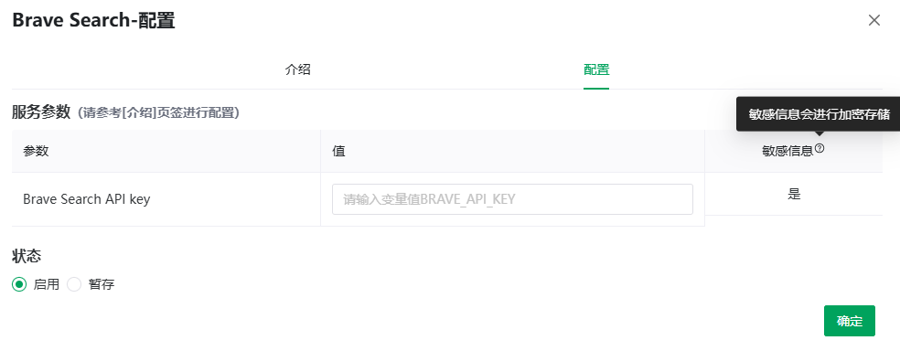

# 服务与工具（MCP）

> [← 使用指南](../index.md) · [English](../../../en/guide/mcp/mcp.md)

MCP（Model Context Protocol）是一种标准化的外部工具接入协议。管理员在系统中登记 MCP 服务后，用户按需**启用并配置参数**，即可让 AI 在对话中调用这些工具（联网搜索、地图查询、数据库检索等）。

左侧菜单**工具**进入工具页，顶部两个视图：

| 视图 | 内容 |
|---|---|
| 服务与工具 | 系统内全部可用服务 |
| 我的工具 | 你已配置的服务 |

> [!NOTE]
> 用户不能自建 MCP 服务，只能使用管理员预置的服务；服务列表分页加载（提示「超过最大页数限制」时请缩小浏览范围或稍后再试）。

## 查看与配置服务

1. 在「服务与工具」中点击服务卡片上的**详情**，阅读 Markdown 介绍与「相关网址：{url}」；
2. 点击**配置**（未配置过的显示**启用**）打开配置弹窗：
   - **介绍**页签：服务说明（Markdown 渲染）；
   - **配置**页签：**服务参数**表（请参考「介绍」页签进行配置）——列为参数 / 值 / 敏感信息；无需参数的服务会提示「该服务无需配置参数即可使用。」；
3. 逐项填写参数值（输入框提示「请输入变量值 {参数名}」）；
4. **状态**选择：
   - **启用**：保存并生效；
   - **暂存**：仅保存草稿，不生效；
5. 点击确定，提示「保存配置成功」。

> [!NOTE]
> 「敏感信息」标记的参数（问号提示：**敏感信息会进行加密存储**）如 API Key、token 等，保存后加密落库，界面不再回显明文。

示例：
<figure>
  
  <figcaption>MCP配置</figcaption>
</figure>

## 在对话中使用

工具需要在**角色**中勾选才会被调用（问号提示原文：「选中项表示本角色可能会用到该服务中的各种工具」）：

- 在[角色进阶设置](../chat/character-config.md#服务与工具-mcp)的「服务与工具(MCP)」中勾选；
- 或在对话输入栏点击**工具**标签即时勾选（弹窗标题「配置角色使用的服务与工具」）。

配置好后，AI 会在需要时自动调用相应工具。

> [!WARNING]
> DeepSeek 模型的深度思考与工具 / 联网搜索互斥：深度思考开启时会提示「DeepSeek 深度思考模式下不支持工具调用，请先关闭深度思考」，或自动关闭工具调用。

## API

顶栏更多菜单 **API** 可生成工具类 API Key，通过 `/ext/v1/mcp` 接口拉取服务清单（全部已支持的 / 当前用户已启用的），详见 [API 参考 · MCP 服务](../../api/mcp.md)。

---

上一篇：[应用与工作流](../workflow/workflow.md) ｜ 下一篇：[模型选择与说明](../model/model.md)
