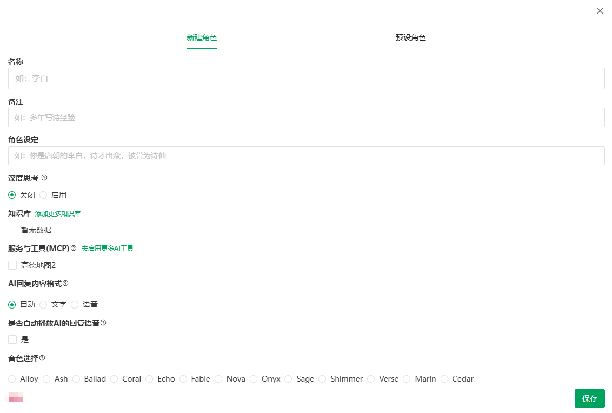
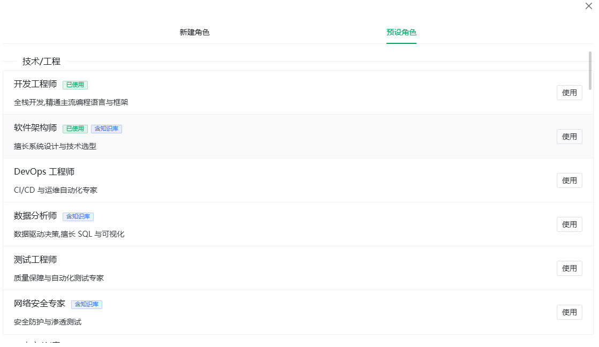

# Characters & Presets

> [← User Guide](../index.md) · [简体中文](../../../cn/guide/chat/character.md)

In AIDeepIn, **a conversation is a character**: each character has its own persona, linked resources and history. Click a character in the left list to switch; hover an entry for the **edit** pencil icon.

> [!NOTE]
> Each account can create up to 50 characters (including copies from presets). At the limit the button shows a message — delete unused characters to free up slots.

## Creating a Character

1. Click **New Character** above the list.
2. The dialog has two tabs: **New Character** and **Presets**; stay on **New Character**.
3. Fill in the form (field details in [Character Settings](character-config.md)); at least the **name** is required.
4. Save — the new character appears at the top of the list.

<figure>
  
  <figcaption>New character dialog</figcaption>
</figure>

## Creating from Presets

Presets are built-in characters grouped by scenario into 11 categories: Tech/Engineering, Content/Creative, Education/Academic, Business/Management, Professional Services, Design/Image, Marketing, Customer Service, Admin/Office, Reporting Assistant, Others.

1. Click **New Character** and switch to the **Presets** tab.
2. Expand a category and browse the entries.
3. Click an entry to view its **persona** and decide whether it fits.
4. Click **Use** — the preset is copied as your own character ("Created successfully").
5. Used presets are marked **Used**; clicking **Use** again switches to the character you copied earlier — no duplicate is created.

> [!TIP]
> Presets tagged **with knowledge base** automatically create a dedicated same-named knowledge base when copied — you get a ready-to-use domain knowledge base without manual setup.

<figure>
  
  <figcaption>Presets</figcaption>
</figure>

## Editing & Deleting

**Edit**: hover a list entry and click the pencil icon (or top bar More → Edit), change the form and **Save**.

**Delete**: open the edit form, click **Delete**, confirm "Delete character {name}?".

> [!WARNING]
> Deleting a character removes **all of its conversation history** and cannot be undone.

---

Previous: [Chat Window](window.md) · Next: [Character Settings](character-config.md)
