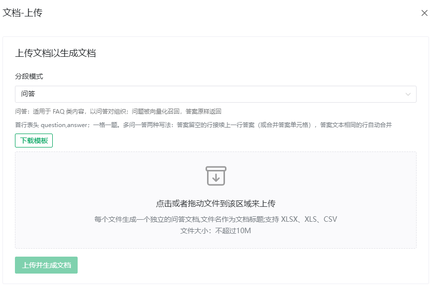
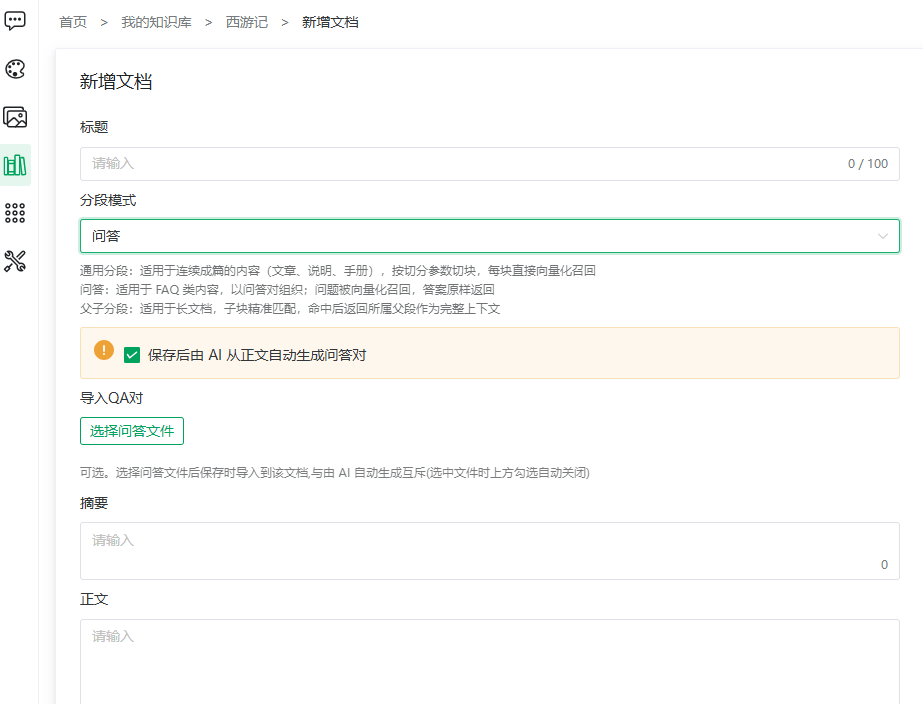

# Q&A Import & Generation

> [← User Guide](../index.md) · [简体中文](../../../cn/guide/knowledge-base/qa-import.md)

Q&A-mode documents use question-answer pairs as the retrieval unit: hitting any question recalls its answer — ideal for FAQs and support scripts. Pairs come from three sources, combinable:

| Source | Best for | Accuracy |
|---|---|---|
| **File import** | An already-curated FAQ sheet | High (manual) |
| **AI generation** | Only raw prose available | Medium (needs proofreading) |
| **Manual maintenance** | A few additions / fixes | High |

## File Import

### Way 1: upload when creating a Q&A document

1. In [editing a document](document.md#editing-a-document), set segmentation mode to **Q&A** and create new;
2. Click **Import Q&A pairs** and pick an XLSX / CSV file;
3. Save — the file's pairs are generated with the document.

File format (in-app hint, translated):

- Header row `question,answer`; **one question per cell**;
- **Multiple questions, one answer** — two ways: rows with an empty answer continue the answer of the row above (or merge the answer cells); rows with identical answer text are merged automatically;
- Each file becomes one standalone Q&A document named after the file.

> [!NOTE]
> Uploading a file is mutually exclusive with "AI auto-generation": picking a file unchecks AI generation automatically. Only one of the two can create the initial pairs.

### Way 2: append to an existing document

1. Open the document's [segment management](segment.md) page (Q&A pair list);
2. Click the header **Import Q&A pairs** (dialog "Import Q&A pairs into '{document}'");
3. Pick an XLSX / CSV file — pairs are **appended**, existing content untouched.

<figure>
  
  <figcaption>Import Q&A pairs</figcaption>
</figure>

## AI-Generated Pairs

The AI distills pairs from the document body (using the base's [ingest model](manage.md#_3-document-index-settings-model)):

1. Check **"Auto-generate Q&A pairs from the body after saving"** when creating;
2. Generation runs asynchronously; check the pair list shortly after.

Once pairs exist the control becomes **"Clear current pairs and regenerate"**:

<figure>
  
  <figcaption>AI-generated Q&A pairs</figcaption>
</figure>

> [!WARNING]
> Regenerating **first clears all current pairs** (including manual and imported ones), unrecoverable (confirmation required). Export a backup first if in doubt.

## Manual Maintenance

Click **Add Q&A pair** in the pair list:

1. **Questions**: one per line, **+Add question** for more rows;
2. **Answer**: fill in;
3. Save.

> [!TIP]
> The in-app hint reads: "One answer can be associated with multiple questions; hitting any of them recalls the answer" — attach different phrasings ("how to claim expenses", "expense process", "reimbursement") to one answer to increase the hit rate.

Row actions on existing pairs: **Edit** (refills questions and answer), **Disable / Enable**, **Delete**.

## Tips

- Official material, accuracy first → organize and import manually;
- Lots of existing prose → AI-generate first, then proofread each pair;
- New frequent questions after launch → append manual pairs or files; avoid regenerating everything.

---

Previous: [Import Documents](document.md) · Next: [Segment Management](segment.md)
