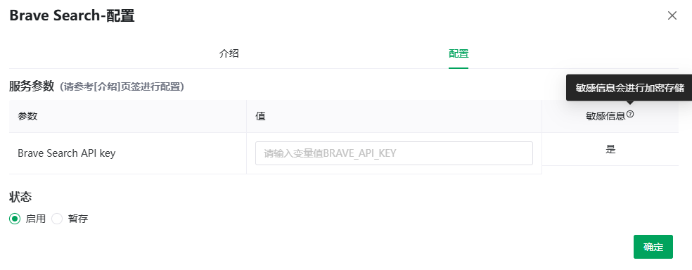

# Services & Tools (MCP)

> [← User Guide](../index.md) · [简体中文](../../../cn/guide/mcp/mcp.md)

MCP (Model Context Protocol) is a standard protocol for external tool integration. Once the admin registers MCP services, users **enable and configure** them on demand, letting the AI call those tools in chat (web search, map queries, database lookups…).

Open the **Tools** page from the left menu; two views at the top:

| View | Content |
|---|---|
| Services & tools | All services available in the system |
| My tools | Services you have configured |

> [!NOTE]
> Users cannot create MCP services — only use the ones the admin provides; the list paginates ("maximum page limit exceeded" means narrow down or retry later).

## Viewing & Configuring

1. Click **Details** on a card to read the Markdown intro and related links;
2. Click **Configure** (**Enable** if never configured) to open the dialog:
   - **Intro** tab: the service description (Markdown);
   - **Configure** tab: the **service parameters** table (refer to the Intro tab) — parameter / value / sensitive; services needing nothing say "This service can be used without any parameters.";
3. Fill in the values (input hint: "Enter the value for {parameter}");
4. Set **Status**:
   - **Enabled**: saved and active;
   - **Stash**: draft only, not active;
5. Confirm — "Configuration saved".

> [!NOTE]
> Parameters marked **sensitive** (tooltip: "sensitive information is stored encrypted") such as API keys are stored encrypted in the database. Opening the settings form decrypts them for editing and returns the values to the frontend; encryption at rest does not prevent this authorized response.

<figure>
  
  <figcaption>MCP config</figcaption>
</figure>

## Admin HTTP parameter bindings

For SSE and Streamable HTTP services, the admin selects **HTTP binding** (`query` or `header`) and an optional **Request name** for each preset or user-defined parameter. The parameter `name` remains the stable identifier for users' stored values. A missing `bind_type` defaults to Query and a missing `bind_name` defaults to `name`, so existing entries need no data migration. STDIO environment names keep their existing behavior.

A user-defined Header can use `bind_value_template: "Bearer {value}"` with `bind_name: "Authorization"`; `{value}` refers only to that definition's user value. Leaving the template unset uses the raw value. A preset Header uses its configured constant. Header values do not enter the URL; Query names and values are URL-encoded. Explicitly bound parameters must have nonblank scalar values; empty/unknown binding types, invalid templates, malformed headers and duplicate Header names (case-insensitive) are rejected. Duplicate explicit Query bindings are rejected; the legacy user-over-preset Query override is retained.

Users keep the same value-entry form. Save and re-open it when changing a token, then verify the service is enabled and selected for the intended character. HTTP transport request/response logging is disabled; this does not remove the settings response's documented decryption behavior. Share neither settings payloads nor unredacted tokens.

## Using in Chat

Tools must be checked on a **character** to be callable (tooltip, translated: "Checked items mean this character may use the tools in those services"):

- Check them under **Services & Tools (MCP)** in [Character Settings](../chat/character-config.md#services-tools-mcp);
- Or click the **Tools** tag in the chat input bar ("Configure the services & tools for the character").

Once configured, the AI calls tools as needed.

> [!WARNING]
> DeepSeek's deep thinking is mutually exclusive with tools/web search: with thinking on, "DeepSeek deep thinking does not support tool calls; disable deep thinking first" — or tool calling is auto-disabled.

## API

The **API** item in the more menu generates a tools API key; `/ext/v1/mcp` returns the service list (all supported / active for the current user) — see [API Reference · MCP Services](../../api/mcp.md).

---

Previous: [Apps & Workflows](../workflow/workflow.md) · Next: [Model Selection](../model/model.md)
