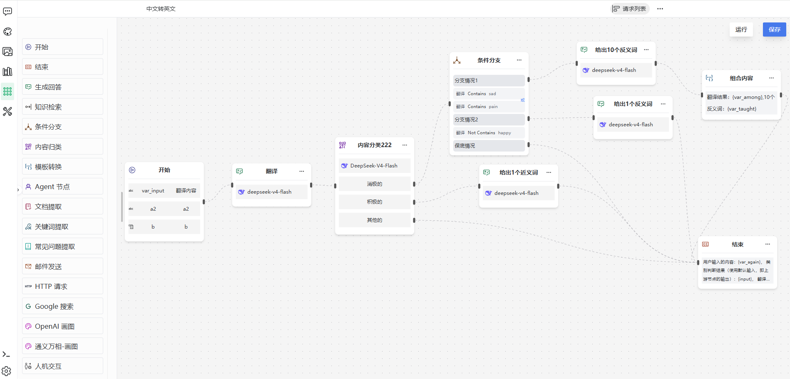
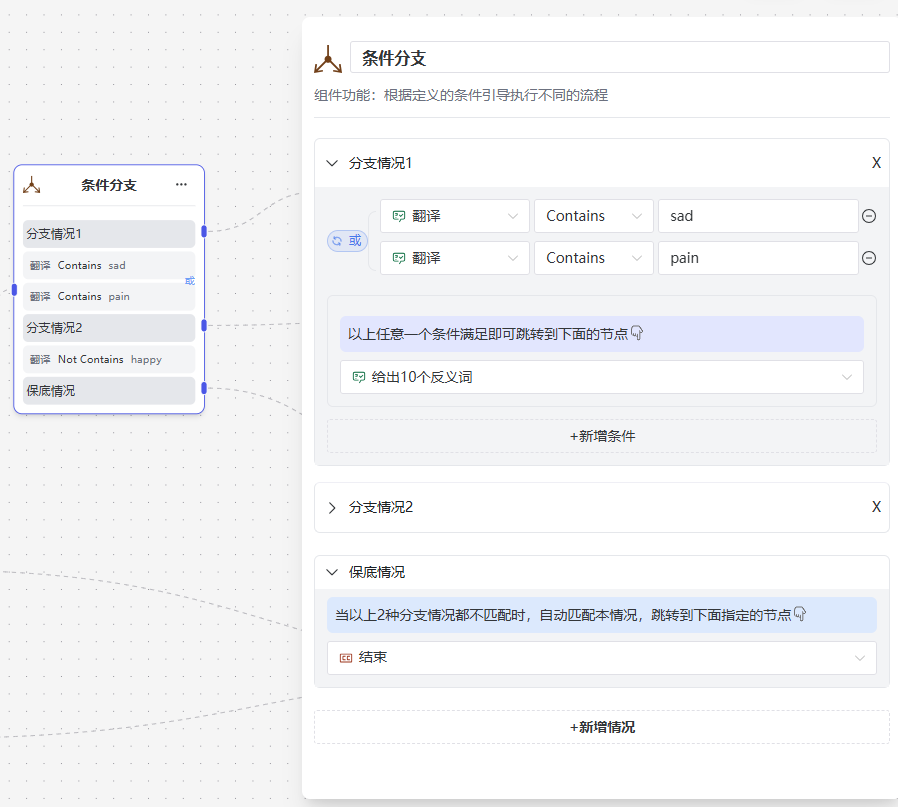

# Apps & Workflows

> [← User Guide](../index.md) · [简体中文](../../../cn/guide/workflow/workflow.md)

The **Apps** menu item is the workflow feature: visually orchestrate processing nodes into automated AI flows (translation, FAQ extraction, multi-step content generation), run them repeatedly, or trigger them via API.

## My Apps

- The sidebar has **Mine / Public** tabs;
- Click an entry to open it; hovering shows the edit entry.

### Creating an App

1. Click **New App**;
2. Fill in the form:

| Field | Description |
|---|---|
| Node | Display name |
| Title (required) | App name, e.g. "Translator" |
| Remark | Purpose |
| Public | Others can see and copy it once public |

3. Confirm to enter the app page.

### Editing / Deleting an App

Buttons in the edit dialog:

| Button | Description |
|---|---|
| Update | Save changes to the current app |
| Save as new | Save as another new app |
| Delete | Confirms "Inputs and outputs will be deleted together. Continue?" — run history goes too |

> [!NOTE]
> Non-creators opening a public app get view-only mode — the save button is disabled with "Only the workflow's creator can save". To modify someone else's app, use **Copy** in the more menu to get your own editable copy.

## Layout

Top bar: app title, the **Workflow ↔ Requests** view switch (hover: "Switch to flow / request list"), and the more menu (**Edit / View**, **Copy**, **API**).

- **Workflow view**: the canvas editor;
- **Requests view**: the run history of this app.

<figure>
  
  <figcaption>App page</figcaption>
</figure>

## Editing a Workflow

1. **Edit** in the top-bar more menu enters edit mode;
2. Drag nodes from the left **node panel** onto the canvas (grouped by component);
3. Connect nodes into a flow;
4. Select a node and configure it in the right **properties panel** (name + component description + parameters);
5. **Run** tries the flow on the canvas; **Save** persists; **Re-layout** re-arranges node positions;
6. Delete nodes via their own delete action.

> [!WARNING]
> **Only one start node** is allowed — dragging a second one triggers a warning. The start node is the flow's only entry.

### Variable References (prompt boxes, general rule)

Input boxes with the variable icon (prompts, query content, mail subjects…) support variables; the grey hint above the box reads:

1. Use curly braces to reference variables defined in **Inputs**, e.g. `{var_name1}`;
2. Use `{input}` to reference the default execution result of the previous node.

## Available Nodes (17)

### Basic nodes

#### Start

Defines input variables (**+Add variable**): name, label, type (text / number / file / boolean), required, multiple, max files (file type); plus an opening message.

#### End

Assembles the output (variables allowed); default "Task completed".

#### Generate answer

LLM reply. Prompt tooltip (translated): "If empty, the output of the previous node is used as the prompt".

#### Human interaction

Pauses for user input; "pre-input hint" is shown while paused.

### AI nodes

#### Agent

Autonomous node: pick a role; prompt (empty = previous node's output); capability switches **RAG / MCP tools / web search** ("The model does not support web search" beside the switch when unsupported).

#### OpenAI image

Prompt (empty = previous output), size, quality, seed (+ "Random generate").

#### Wanxiang image

Same as [OpenAI image](#openai-image) (DashScope text-to-image).

#### Document extraction

Extracts text from uploaded files. Without a file input on start: "The start node has no file-typed parameter; add one first".

#### Keyword extraction

Model + keyword count.

#### FAQ extraction

Model + question count, country/region, language.

#### Classification

Model + categories (name per class), each routed to a next step.

### Knowledge nodes

#### Knowledge retrieval

Searches the selected knowledge base:

| Parameter | Description |
|---|---|
| Knowledge base | The base to search |
| Query content | Variables allowed |
| Top-k | Slider |
| Min score | Slider |
| Strict mode | Tooltip (translated): "Strict: strictly match the knowledge base; no result → 'no answer'. Lenient: no result → pass the question to the LLM." |
| Default reply | Tooltip: "Used when there is no answer" |

### Logic nodes

#### Condition

- Each condition group is **AND / OR**:
  - AND: "Jumps to the node below when **all** conditions above are met";
  - OR: "Jumps to the node below when **any** condition above is met";
- **Fallback**: "When none of the {count} branch cases above match, this case applies automatically and jumps to the node specified below";
- At least one condition and one branch case must remain (validated on delete).

#### Template

Composes text from a template with `{var}`, `{input}`.

### Integration nodes

#### HTTP request

Timeout (s), retries, headers (+add), params (+add), Content-Type; **Strip HTML** tooltip (translated): "Turn it on if the response is HTML and only the main content is needed."; output variables: `status_code` (HTTP status code), `output` (response body).

#### Email

Sender (system / custom); custom: SMTP server (e.g. smtp.exmail.qq.com), port, sender name / email / password; recipients (required, comma-separated), cc, subject (required), body (required, variables allowed).

#### Google search

Query (tooltip: empty = previous node's output), result count, country/region, language.

<figure>
  
  <figcaption>Properties panel</figcaption>
</figure>

## Running & Requests

1. **Run** on the canvas (or launch from the app page): fill the start node's inputs (files: TXT, PDF, DOC, DOCX, XLS, XLSX, PPT, PPTX, ≤ 10MB);
2. A **request** record is created; the **requests list** pages through history;
3. Click for the **execution detail**: each node's inputs/outputs, file previews (download offered when inline preview is unsupported);
4. Flows with a **human interaction** node pause with "Paused, waiting for user input…" plus the configured hint; type **text** in the input box to resume (file inputs are only available in the flow's start section);
5. Records can be deleted or cleared ("Inputs and outputs will be deleted together. Continue?").

> [!TIP]
> When debugging, run small inputs end to end first, then inspect each node's inputs/outputs in the detail view to locate the problematic node.

## API

The **API** item in the more menu generates this app's API key and docs; trigger externally with `POST /ext/v1/workflow/run` — see [API Reference · Workflow](../../api/workflow.md).

---

Previous: [Knowledge Base Q&A](../knowledge-base/kb-qa.md) · Next: [Services & Tools](../mcp/mcp.md)
